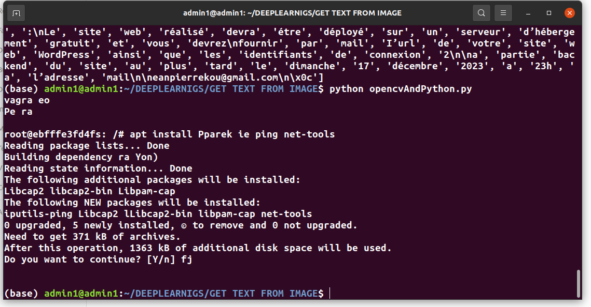

## ALL PROCESS TO GET TEXT FROM AN IMAGE USING OPENCV AND PYTESSERACT

### INSTALLATION:  
### this proccess is for linux sys
#### sudo apt-get install opencv-python pytesseract tesseract-ocr

## Now after that , you can write your code to get all text from image

# FOR EXAMPLE: 

###### 
#### import cv2
#### import pytesseract

# Read the image using OpenCV
#### image = cv2.imread('path_to_your_img.jpeg')

# Convert the image to grayscale
#### gray_image = cv2.cvtColor(image, cv2.COLOR_BGR2GRAY)

# Use Tesseract to do OCR on the grayscale image
#### text = pytesseract.image_to_string(gray_image)

# Print the extracted text
#### print(text)

#### Example of output:

